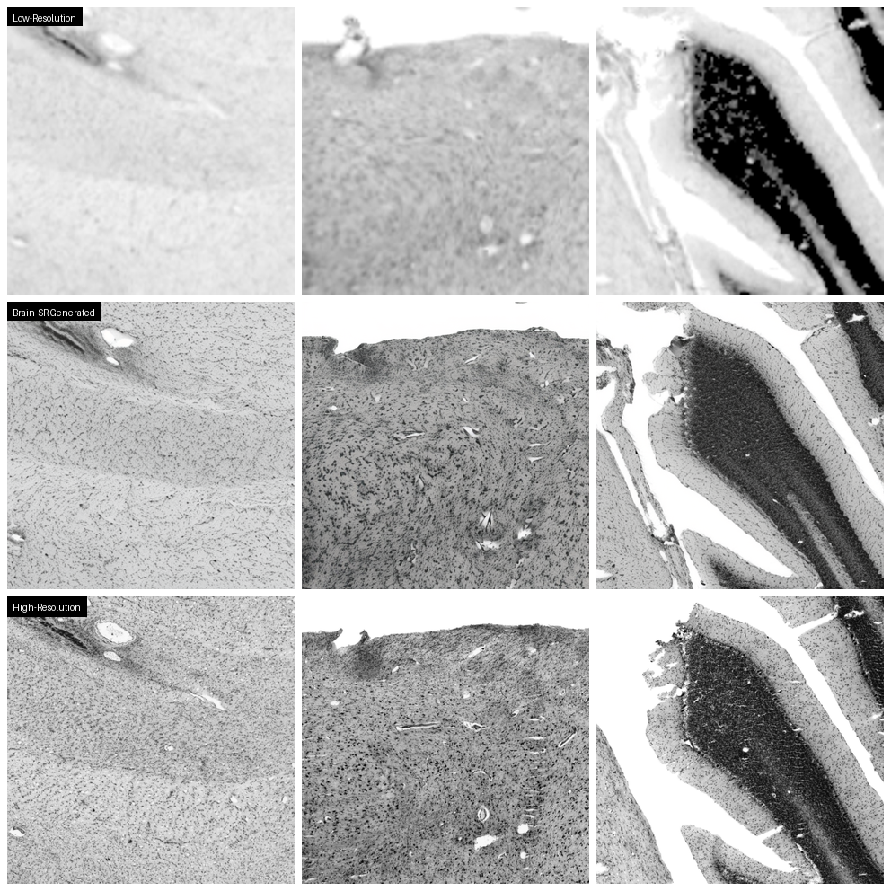

# Brain-SR: Frequency-Guided Diffusion for Histological Brain Image Super-Resolution

[](https://www.python.org/)
[](https://pytorch.org/)

[](LICENSE) 

---

## Overview

**Brain-SR** is a diffusion-based deep learning framework for super-resolution of histological brain images.  
Built upon the **InvSR** paradigm, it performs resolution enhancement in the **latent space** of a pretrained VAE, guided by a noise-predictor network and frequency-domain supervision.

The model is trained on **BigBrain** histological sections to reconstruct high-resolution cortical images from low-resolution inputs, preserving neuronal and fiber-like structures essential for morphometric and cytoarchitectural studies.


### Sample Results



---

## Environment Setup

Create and activate a venv environment:

```bash
python -m venv brainsr
source brainsr/bin/activate
pip install torch==2.4.0 torchvision==0.19.0 torchaudio==2.4.0 xformers==0.0.27.post2 --index-url https://download.pytorch.org/whl/cu121
pip install -e ".[torch]"
pip install -r requirements.txt
```

---

## Inference

Run super-resolution inference on your brain histology images:

```bash
python inference_invsr.py -i [input_folder_or_image] -o [output_folder] --num_steps 1
```

### Inference Options

- `--cfg_path`: Configuration file (default: `./configs/sample-sd-turbo-brainsr.yaml`)
- `--num_steps`: Number of sampling steps (default: 1)
- `--chopping_size`: Patch size for processing large images (default: 128, recommended: 256 for very large images)
- `--chopping_bs`: Batch size for chopped patches (default: 8, use 1 for limited GPU memory)
- `--sd_path`: Path to pre-downloaded Stable Diffusion Turbo model
- `--started_ckpt_path`: Path to pre-trained noise predictor checkpoint
- `--tiled_vae`: Enable tiled VAE for memory efficiency (default: true)

### Example

```bash
python inference_invsr.py -i ./test_images/brain_lr/ -o ./results/ --num_steps 1
```

---

## Training

### Preparation

1. **Download LPIPS model**: Download the finetuned LPIPS model and place it in the `weights/` folder:
   ```bash
   wget https://huggingface.co/infopz/brain-sr/resolve/main/vgg16_sdturbo_lpips.pth -P weights/
   ```

2. **Configure training**: Edit the configuration file [`configs/brain-sr.yaml`](configs/brain-sr.yaml):
   - `data.train.params.dir_path`: Path to train low-resolution images
   - `data.train.params.extra_dir_path`: Path to train high-resolution images
   - `data.val.params.dir_path`: Path to validation low-resolution images
   - `data.val.params.extra_dir_path`: Path to validation high-resolution images
   - `configs.train.batch` and `configs.train.microbatch`: Adjust batch sizes

### Start Training

Single or multi-GPU training:

```bash
# Single GPU
CUDA_VISIBLE_DEVICES=0 python main.py --save_dir logs/brain-sr-run --cfg_path configs/brain-sr.yaml

# Multi-GPU (4 GPUs)
CUDA_VISIBLE_DEVICES=0,1,2,3 torchrun --standalone --nproc_per_node=4 --nnodes=1 \
  main.py --save_dir logs/brain-sr-run --cfg_path configs/brain-sr.yaml
```

### Resume Training

```bash
CUDA_VISIBLE_DEVICES=0,1,2,3 torchrun --standalone --nproc_per_node=4 --nnodes=1 \
  main.py --save_dir logs/brain-sr-run --resume logs/brain-sr-run/ckpts/model_[step].pth
```

---

## Dataset Generation

Brain-SR uses paired low-resolution and high-resolution crops from the BigBrain dataset for training.

### BigBrain Dataset

The [BigBrain project](https://bigbrainproject.org/) provides ultra-high-resolution (20 microns) 3D reconstruction of a human brain. For this project:

- **Low-resolution data**: Coronal sections in MINC format (download via [FTP](https://ftp.bigbrainproject.org/bigbrain-ftp/BigBrainRelease.2015/2D_Final_Sections/Coronal/Minc/))
- **High-resolution data**: Aligned high-resolution TIFF images (download from [EBRAINS](https://search.kg.ebrains.eu/instances/73c1fa55-d099-4854-8cda-c9a403c6080a))

### Generate Training Crops

Use the provided script to generate paired crops from BigBrain data:

```bash
python scripts/crops_generator.py
```

The script is configured with the following parameters:

```python
lr_path = "BigBrain/low_res_coronal_minc/"      # Low-resolution MINC files
hr_path = "BigBrain/high_res_aligned/"           # High-resolution TIFF + affine JSON files
out_path = "crops_datasets/train/"               # Output directory

crop_config = CropConfig(
    lr_crop_size=128,      # Size of low-resolution crops
    hr_crop_size=512,      # Size of high-resolution crops (4x upscaling)
    stride=64,             # Stride for crop extraction
    white_threshold=0.9,   # Threshold to exclude background-heavy crops
    downsampled_sigma=2    # Gaussian smoothing for alignment
)
```

Edit the paths and parameters directly in [`scripts/crops_generator.py`](scripts/crops_generator.py) before running.

### Dataset Structure

The generated dataset should have the following structure:

```
crops_datasets/
├── train/
│   ├── lr/          # Low-resolution crops (128x128)
│   └── hr/          # High-resolution crops (512x512)
└── val/
    ├── lr/
    └── hr/
```

---

## Acknowledgements

This project is built upon several excellent works:

- **[InvSR](https://github.com/zsyOAOA/InvSR)**: The foundational super-resolution framework using diffusion inversion (CVPR 2025)
- **[BigBrain Project](https://bigbrainproject.org/)**: For providing the ultra-high-resolution brain histology dataset
- **[BasicSR](https://github.com/XPixelGroup/BasicSR)**: Basic image processing and training utilities
- **[diffusers](https://github.com/huggingface/diffusers)**: Hugging Face diffusion models library

Special thanks to the InvSR authors for their innovative approach to image super-resolution and to the BigBrain consortium for making their data publicly available.

---

## License

This project is licensed under [NTU S-Lab License 1.0](LICENSE). Redistribution and use should follow this license.

---

## Contact

For questions or issues, please open an issue on this repository or contact [federico.bolelli@unimore.it].
